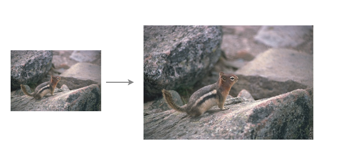

# Zero shot super resolution
<center>
  
</center>

# Intro
Implementation and suggestions for improvement of "Zero-Shot" Super-Resolution using Deep Internal Learning
https://arxiv.org/abs/1712.06087
# Setup
First download the code by git clone the repo:
```bash
git clone https://github.com/galprz/ZSSR-pytorch
```
```bash
conda end update -f environment.yml
conda activate brain-tumor-segmentation
```
# Pretrain VDSR
The VDSR model trained on BSDS300 using [this google colab](https://colab.research.google.com/drive/1bJiBON-ayQgdQ8oeP4rFMPevBjv3rt9w) based on [this github](https://github.com/2KangHo/vdsr_pytorch)

To run the experiment transfer notebook you need to download first the pretrain VDSR model from [here](https://drive.google.com/open?id=1bvkWzt1A5VshaA73h005z8TFrQDhCTev) and put it in the 'model' folder under the root folder


# Code structure
+ config - the cofiguration for the experiments.
+ loss contains the implemntation of the ContentLoss
+ metrics - the psnr and ssim metrics
+ model - zssr and vdsr implementation
+ train_and_eval - helper function fo training
+ transforms - transforms for lr and hr pairs
+ utils - helpers functions
+ data - contains the class for the dataset and data sampler

# Experiments
+ experiment notbook - contains data exploration and sanity check for the model
+ experiment pixelshuffle - comparison between ZSSR to ZSSR with pixel shuffle
+ experiment transfer - comparison between ZSSR to ZSSR with VDSR as backbone
+ experiment content loss - comparison between ZSSR with l1 loss and ZSSR with content loss

# Dataset
To run the experiments download the dataset from [here](https://ndownloader.figshare.com/files/21952197) and unzip it to the root folder